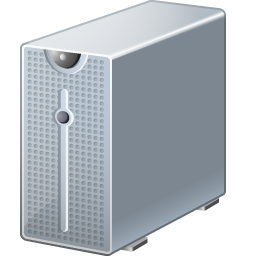

= 

[.text-center]
*Les 10 commandements de l'Intégration Continue*

== I - Avoir son logiciel de gestion de versions image:images/git.png[width=32]  

== II - Automatiser le Build  

== III - Build Self-testing   

== IV - Commiter son travail tous les jours image:images/pc-feu.jpg[width=48]  

== V - Déployer à chaque Build en succès   

== VI - Corriger Build cassé immédiatement   

== VII - Garder un Build rapide   
 
== VIII - Tester sur un env clone de la prod image:images/docker.jpg[width=48]  

== IX - Rendre disponible les artéfacts produits   

== X - Tout le monde voit ce qu'il se passe   
