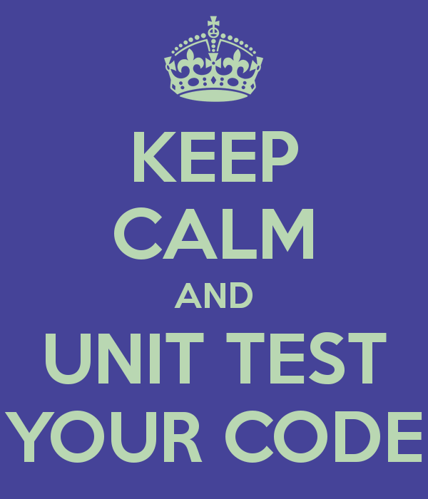
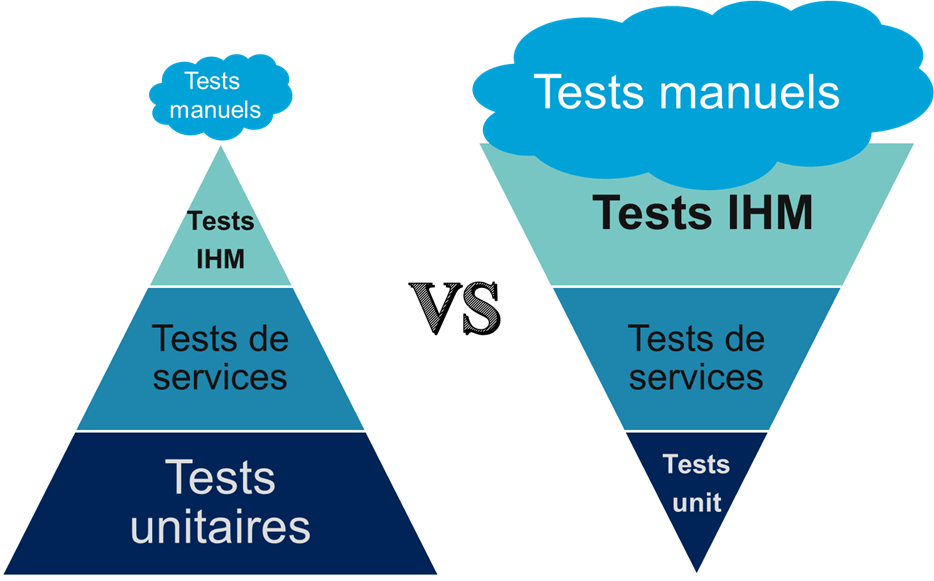
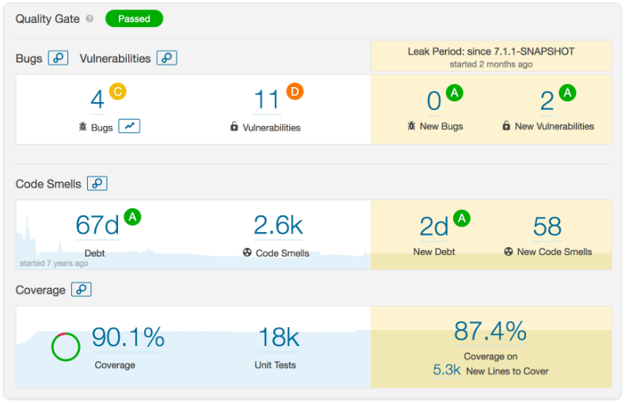
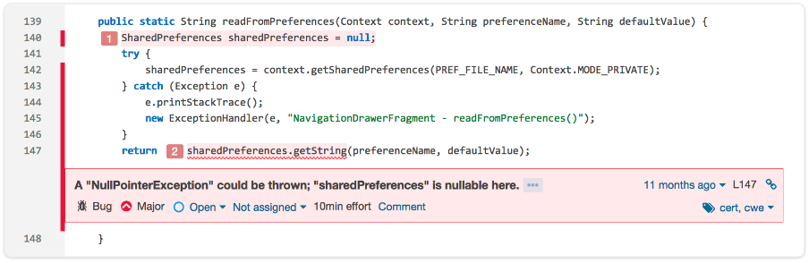
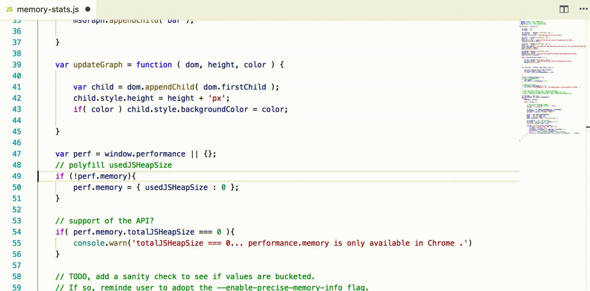

= §2. Je développe

== Où mettre mon code?
image:images/github.jpg[width=300]

== Comment builder mon code? 

  

    

== Stocker ses artefacts

  

== Une histoire de tests

== Coder c'est tester!
* Quand l'appli est KO
** savoir *rapidement* *où* dans le code et *pourquoi*
* Construire sa couverture de tests et *TNR* (Tests Non Régression)
* Impact sur conception, modularité
* Outils
** JUnit, TestNG, Mockito, DbUnit, utPLSQL...
** maven-surefire-plugin (UT), maven-failsafe-plugin (IT)

== Continuous Inspection

== Bug detection

== Et dans son IDE 

