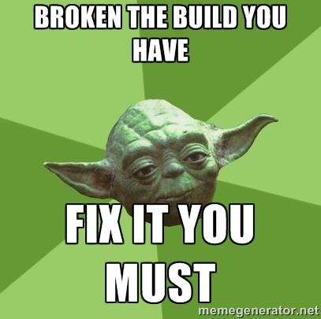
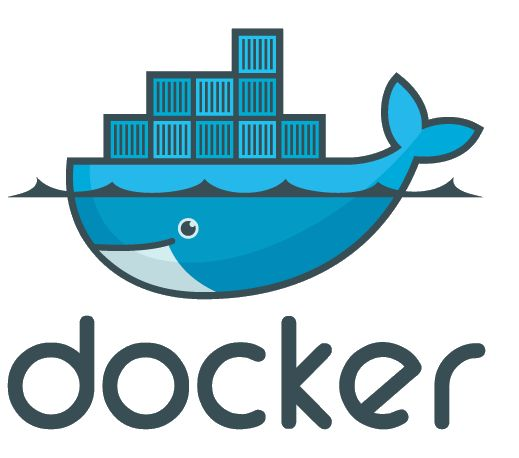

= §1. Intégration continue

== Développer... la préhistoire
image::drawio/dev-solo.png[]

== Développer... un peu mieux
image::drawio/dev-git.png[]

== Développer... beaucoup mieux

== Intégration Continue
* Normaliser le build
* Intégrer/tester le travail de tous sur endroit commun
* *Feedback* le plus vite possible
* Il reste à définir le "ça marche"

== Les 10 commandements de l'IC

Source:: http://www.martinfowler.com/articles/continuousIntegration.html

== I - Logiciel de gestion de versions
image:images/git.png[height=100]

Everything as code::
code (java, js, ...), conf (properties, json, yaml,...), doc (asciidoc, markdown, ...), env (Dockerfile, Vagrantfile, playbook Ansible, bash...)

SSOT: Single Source Of Truth::
Point de vérité unique

== II - Automatiser le Build

Tout doit être scripté (bash, python, maven, groovy, ...)

== III - Build Self-testing
image:images/self-test.png[]

* Lors d'un build, on joue a minima les tests unitaires!
** *build KO* si *test KO*

IMPORTANT: Pas de maven *skipTests* svp

== IV - Toute l'équipe commite son travail tous les jours
image::images/pc-feu.jpg[]

Travail = Gestion de conf, fichiers conf, CR, doc, code, test, ...

== V - Déployer en intégration à chaque Build en succès
image:images/ok.png[width=300] image:images/pc.png[width=300]

IMPORTANT: Se rassurer sur capacité à déployer

== VI - Corriger Build cassé immédiatement

== VII - Garder un Build rapide
image::images/vitesse.jpg[]

* Surveiller si > 10 min (on veut des retours rapides)
** A optimiser si on dépasse
** Constructions en étapes sinon (mode parallèle...)

IMPORTANT: Ne pas bloquer les Dév

== VIII - Tester sur un environnement clone de la production...

* ... ou du moins tendre vers l'env de prod
* Virtualisation / conteneur offre LA solution

== IX - Rendre facilement disponible les artéfacts produits

== X - Tout le monde voit ce qu'il se passe

* Dashboad des jobs (build en cours, statut, trace erreur)
* Notifications

== Vocabulaire

== Viser le Continuous Deployment
image::images/netflix.png[]

Pourquoi?::
* Time-to-Market
* Diminuer les risques en livrant souvent, tout le temps
** Livraison = "non événement"

== Résumé sur l'Intégration Continue
Avantages::
* Retour immédiat et constant via notification à l’équipe
* Vérification des régressions sur le code
* Vérification de la qualité du code
* Automatisation du processus de build
A retenir::
* L’Intégration Continue n’élimine pas les erreurs mais rend sa correction plus rapide et
facile
