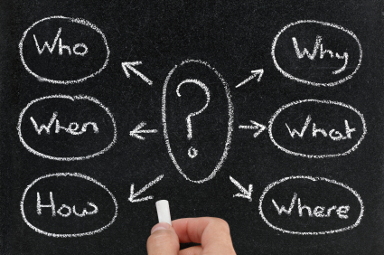

= Plateforme Intégration Continue

== Une plateforme d'outils...
image::drawio/pic.png[width="700"]

== ...mais aussi une méthodologie!

IMPORTANT: *Les outils ne font pas la méthodo!!!*

== image:images/menu.png[]
. Intégration Continue
. Je développe
. J'automatise