= Jenkins : Administration

== Se logger en tant qu'admin

En se connectant en tant qu'admin vous allez pouvoir avoir acces à la console d'administration

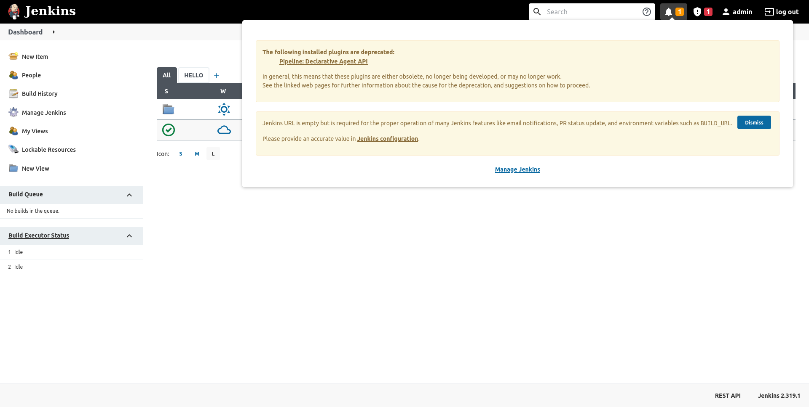

Vous pouvez égalemet remarquer en haut à droites les notifications importantes

== La console d'administration

Cette console permet de configurer l'ensemble de l'outil

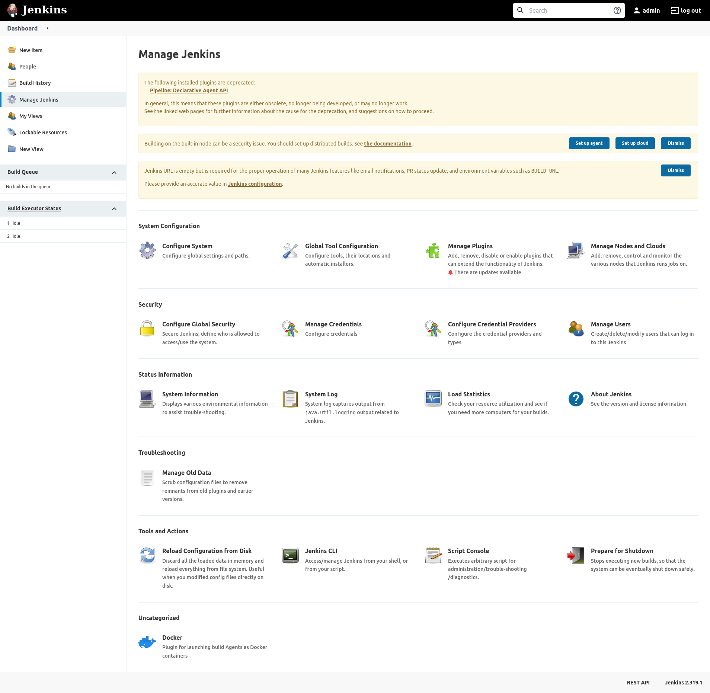

== Configuration Générale

Deux pages sont pour la configuration globale, ici la page de configuration du système 

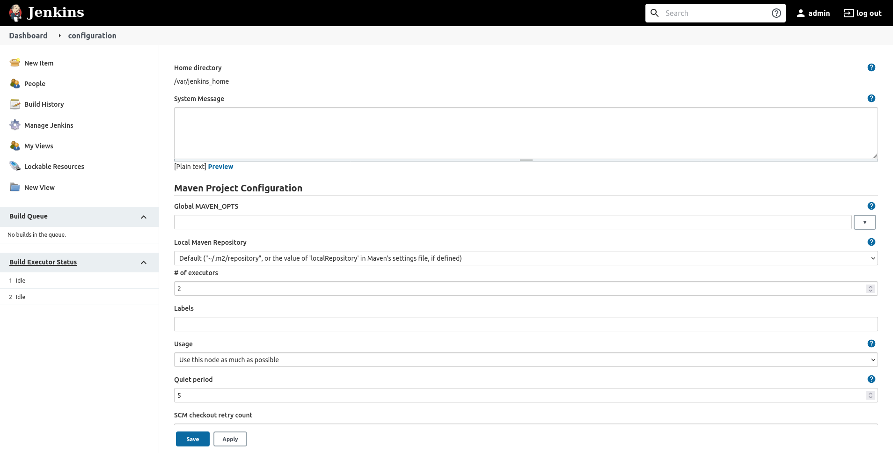

== Configuration Générale

Et la configuration globale des outils annexes (jdk, maven, git)

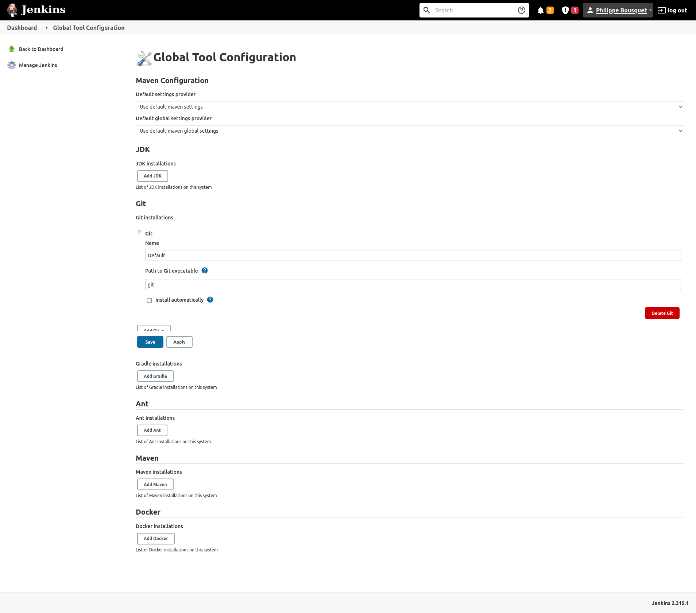

== Configuration des Plugins

Cette pages est relativement importante puisqu'elle vous permettra de gérer vos différents plugins

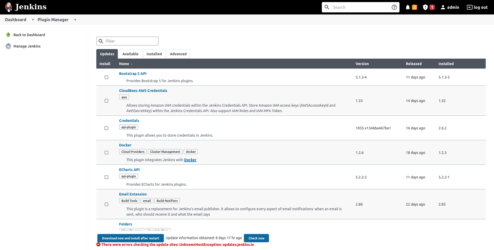

== Pluggins

Afin de vous aider lors de la finalisation de l'installation de Jenkins il vous proposera d'installer les plugins courants

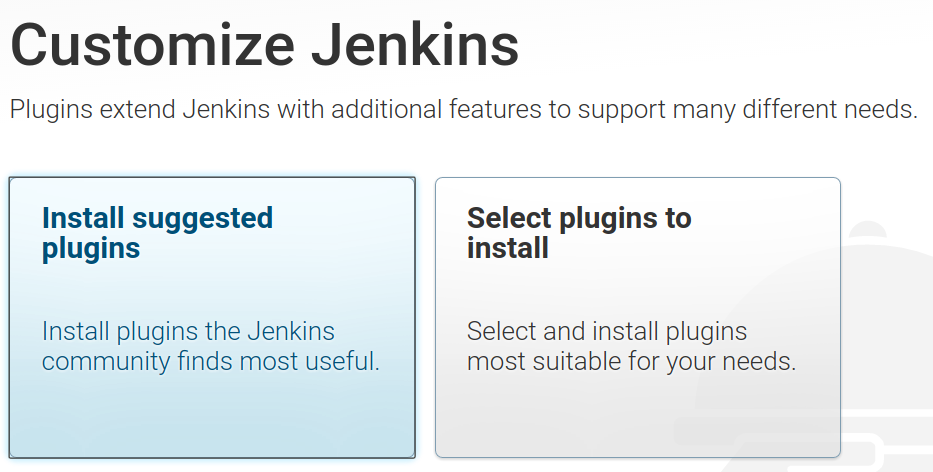

IMPORTANT: Veillez à garder vos pluggins le plus à jour possible

== Configuration des Agents

Jenkins est censé déléguer la gestion des jobs à des agents cette page vous permettra de configurer des nodes (nécessite des serveurs)

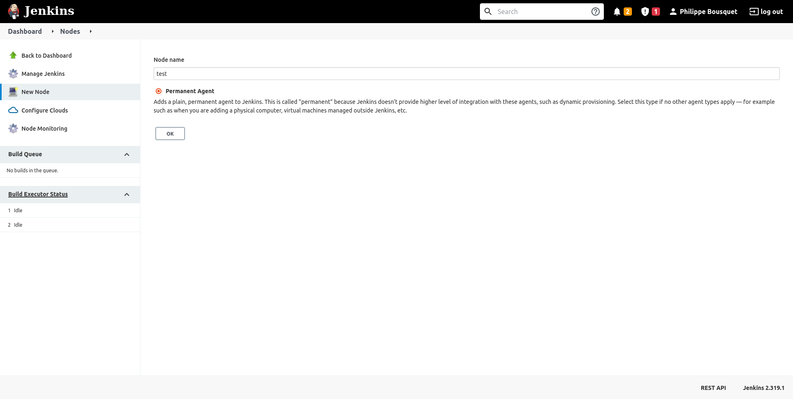

== Utilisateur

Vous pouvez gérer vos utilisateurs au travers de la page *Manage users*

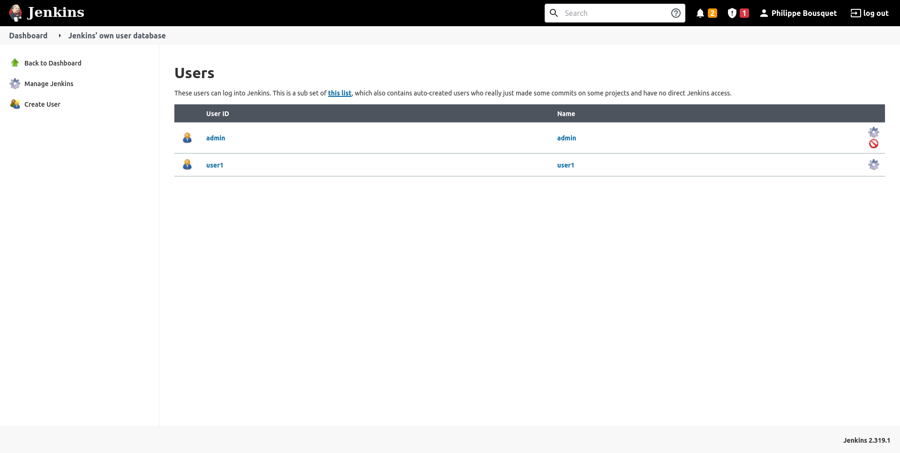

== Nouvel utilisateur

Vous pouvez alors créer un nouvel utilisateur

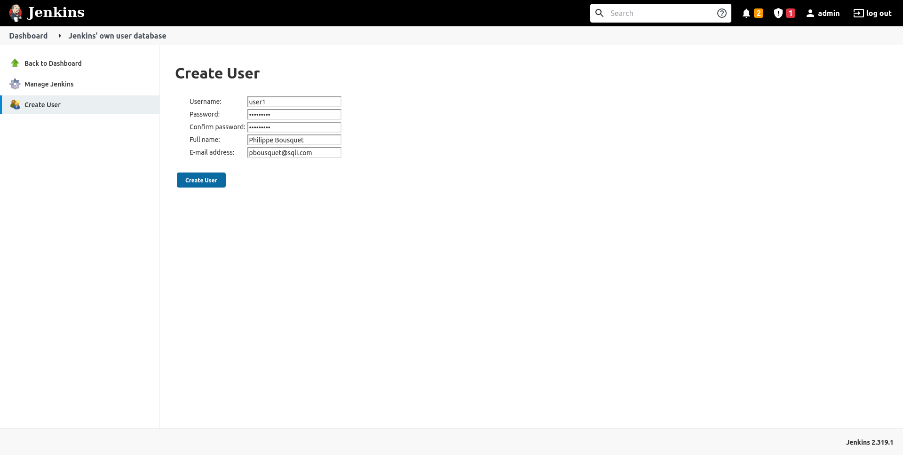

== Sécurité

Cette page vous permet de gérer ce que peuvent faire vos utilisateurs.

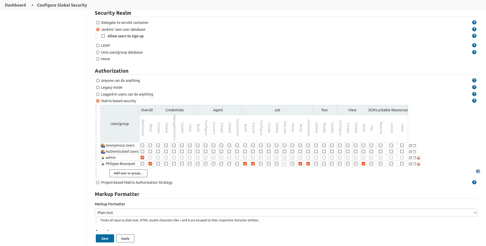

== Crédentials

Cette page vous permet de gérer les crédentials que vous utiliserez dans vos pipelines (user git, user aws, ...).

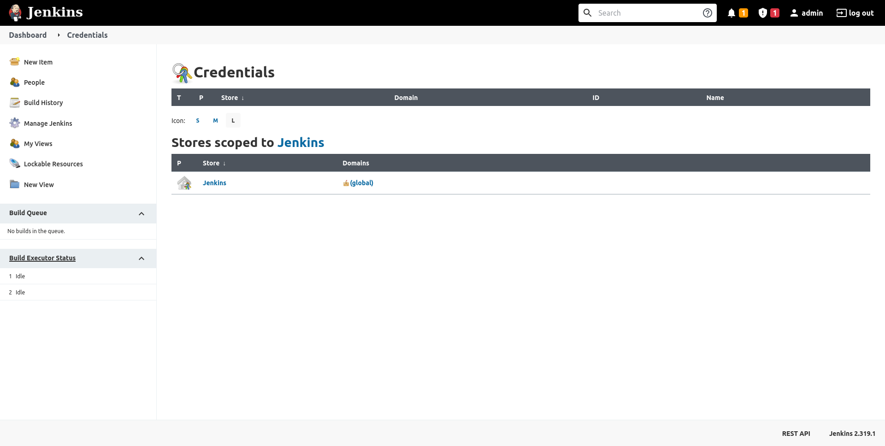

== Monitoring

Enfin jenkins proposes plusieurs page pour monitorer le systemes, par exemple ici la pages des logs de jenkins.

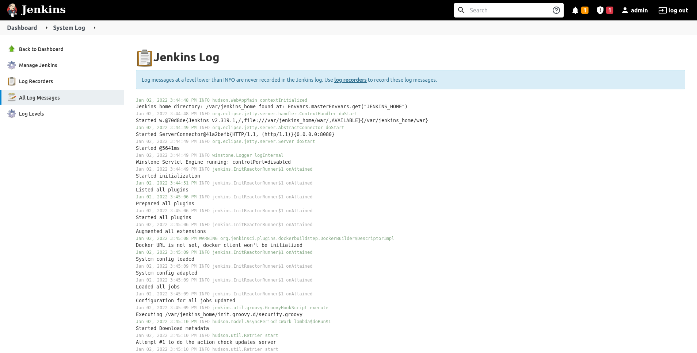
