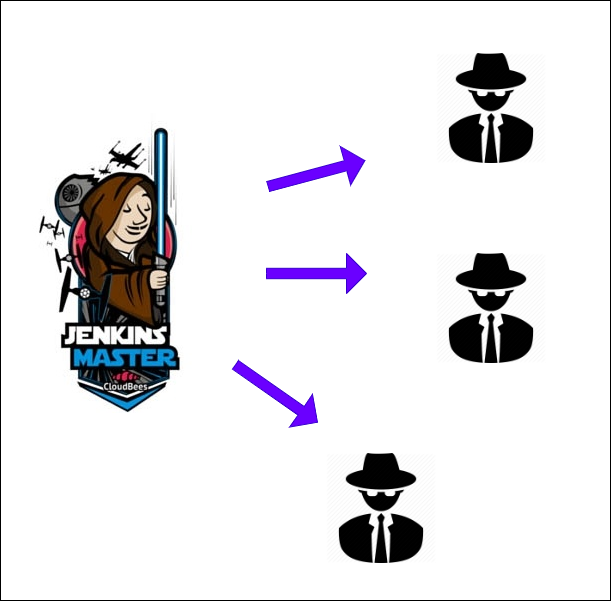
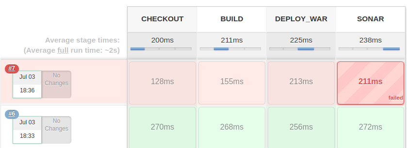
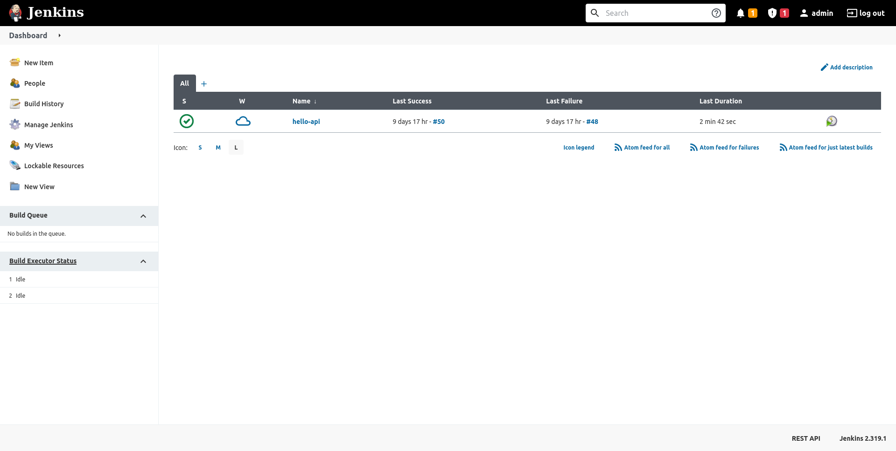

= Jenkins : Installation

== La PIC
image::drawio/pic.png[width="700"]

IMPORTANT: Jenkins se trouve au centre de notre PIC

== Jenkins
image:images/jenkins.png[width=150] image:images/job-list.png[width=500]

Il s'agit d'un executeur de Jobs...

== ou plutôt 

D'un chef d'orchestre qui délègue le job à des agents 

== Un pipeline

[source, groovy]
----
pipeline {
  agent { node { label "slave-docker"} }
  stages {
    stage("BUILD") {
      steps {
        sh "docker run ... maven mvn clean package"
      }
    }
    stage("DEPLOY_WAR") {
      steps {
        sh "docker run ... wildfly ... "
      }
    }
    stage("SONAR") {
      steps {
        sh "docker run ... sonar-scanner ..."
      }
    }
  }
}
----

== Installation 

On peut l'installer au travers des paquest officiels

[source, bash]
----
curl -fsSL https://pkg.jenkins.io/debian/jenkins.io.key | sudo tee \
  /usr/share/keyrings/jenkins-keyring.asc > /dev/null
echo deb [signed-by=/usr/share/keyrings/jenkins-keyring.asc] \
  https://pkg.jenkins.io/debian binary/ | sudo tee \
  /etc/apt/sources.list.d/jenkins.list > /dev/null
sudo apt-get update
sudo apt-get install jenkins
----

== Nécessite Java

Pour fonctionner Jenkins à besoin de Java

[source, bash]
----
sudo apt update
sudo apt install openjdk-11-jdk
----

== Dévloquer Jenkins

La première chose à faire est de débloquer jenkins (sécurité)

image:images/jenkins-unlock.png[width=512]

== Le Dashboard

