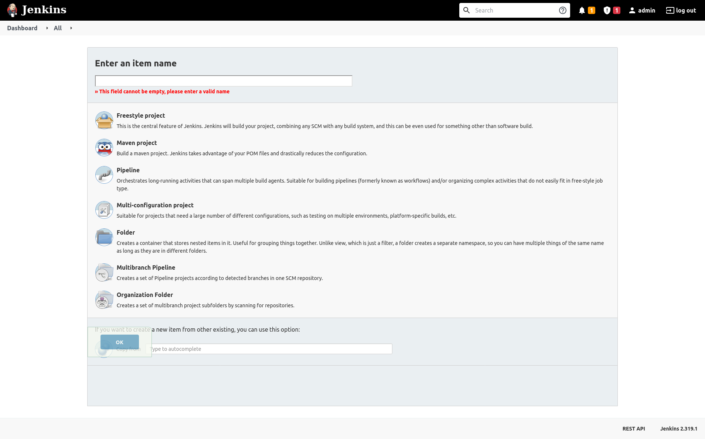
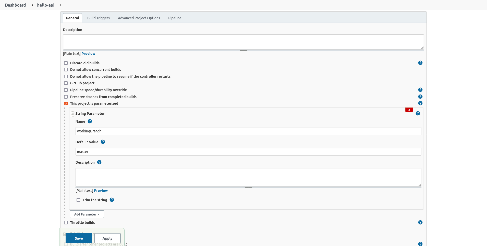
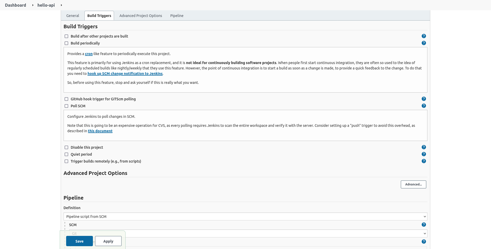
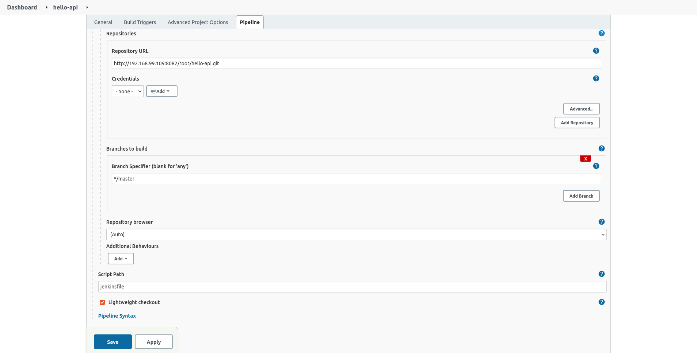

= Jenkins : Piplines

== Créer un job jenkins

L'lien *New -Item* permet de configurer un nouveau Pipline

Vous aurez alors le choix entre plusieurs options (nous choisirons pipelines)

== Configuration Génerale

Cet onglet permet de configurer le job : descriptions, paramètres, ...

== Build Triggers

Cet onglet permet de configurer comment le job sera déclenché (manuellement, périodiquement, sur un commit, ...)

== Définition du pipeline

Cet onglet permet de configurer le repository ainsi que le fichier défiissant le pipeline

== JenkinsFile

Nous allons maintenant pouvoir définir notre pipeline (en groovy) et celui-ci sera hébergé dans notre repository git.

== JenkinsFile : Structure

[source, groovy]
----
node() {
    stage('STAGE1') {
        step('STEP1') {
          ...
        }
    }

    stage('STAGE2') {
        step('STEP1') {
          ...
        }
        step('STEP2') {
          ... 
        }
    }
}
----

== JenkinsFile : Clean

[source, groovy]
----
node() {

    stage('CLEAN WORKSPACE') {
        sh "rm -rf ${workspace}/*"
    }

}
----

== JenkinsFile : Checkout

[source, groovy]
----
...
    stage('CHECKOUT') {
        if (workingBranch == null || "" == workingBranch) {
            workingBranch = 'master'
        }
        git branch: "${workingBranch}", url: "http://192.168.99.109:8082/root/hello-api.git"[, credentials: ""]
    }
...
----

== JenkinsFile : Build Maven

Via maven installé sur la machine

[source, groovy]
----
...
    stage('MAVEN BUILD') {
        sh "mvn clean package"
    }
...
----

Ou via docker

[source, groovy]
----
...
    stage('MAVEN BUILD') {
        sh "mvn clean package"
    }
...
----

== JenkinsFile : Sonar

Via maven

[source, groovy]
----
...
    stage('ANALYSE SONAR') {
        sh "mvn sonar:sonar " +
            "-Dsonar.host.url=http://192.168.99.109:9000 " +
            "-Dsonar.login=42a5cb4ee32a2fed5f677b21be44c99c4614b868"
    }
...
----

Ou sonar-scanner

== JenkinsFile : Déploiement

[source, groovy]
----
...
    def timestamp = new Date().format('yyyyMMddHHmmss')

    stage('UPLOAD S3') {
        sh "aws s3 " +
           "cp ${workspace}/target/testapi-0.0.5-SNAPSHOT.jar " +
           "s3://elasticbeanstalk-eu-west-1-588272595007/hello-api.${timestamp}.jar"
    }

    stage('VERSION APP') {
        sh "aws elasticbeanstalk create-application-version --application-name hello-api " +
           "--version-label hello-api-${timestamp} " +
           "--source-bundle S3Bucket=\"elasticbeanstalk-eu-west-1-588272595007\",S3Key=\"hello-api.${timestamp}.jar\" " +
           "--no-auto-create-application --process"
    }

    stage('DEPLOIEMENT ELB') {
        sh "aws elasticbeanstalk  update-environment --environment-name Helloapi-env " +
           "--version-label hello-api-${timestamp}"
    }
...
----

== JenkinsFile : Test post déploiement

[source, groovy]
----
...    
    stage('TEST API') {
        sh '''#!/bin/bash
              sleep 60
              http_response=$(curl -s -o /dev/null -w "%{http_code}" -X GET "http://helloapi-env.eba-dv8ffvvn.eu-west-1.elasticbeanstalk.com/api/v1/hello" -H  "accept: application/json")
              if [ $http_response != "200" ]; then
                  echo "erreur $http_response sur GET http://helloapi-env.eba-dv8ffvvn.eu-west-1.elasticbeanstalk.com/api/v1/hello"
                  exit 1
              fi
        '''
    }
...
----

== Job Dashboard

Ce dashbord permet de visualiser les anciennes exécutions ainsi qe de déclencher une exécution manuelle

image:images/jenkins-pipeline.png[width=640]
