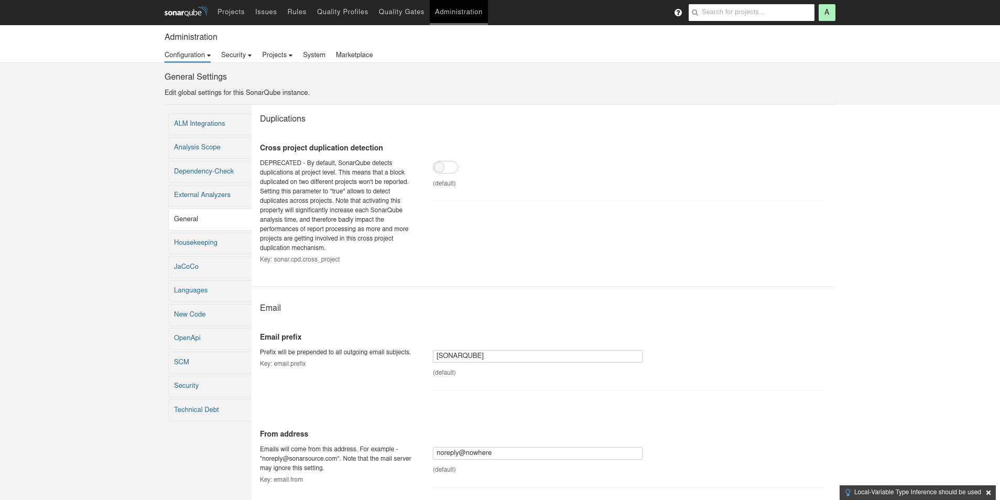
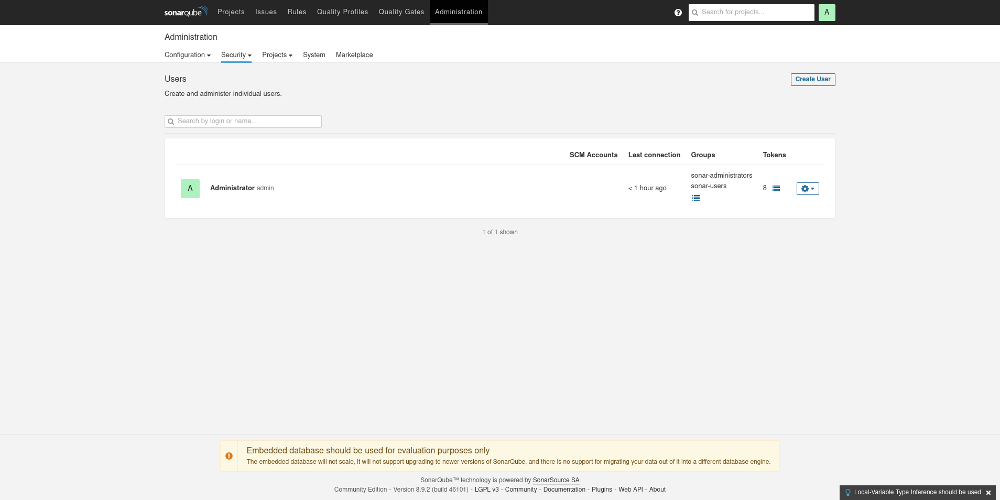
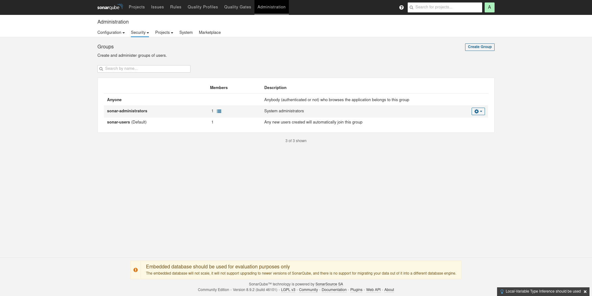
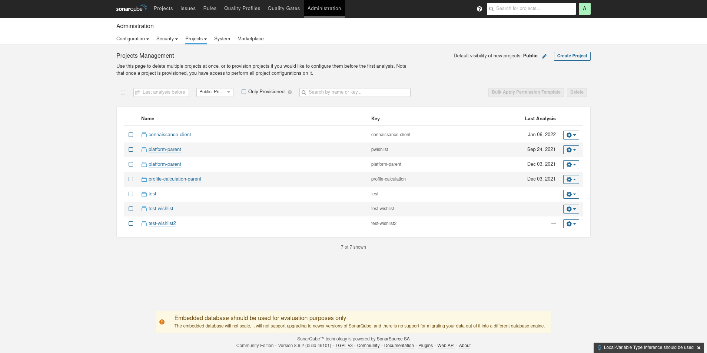
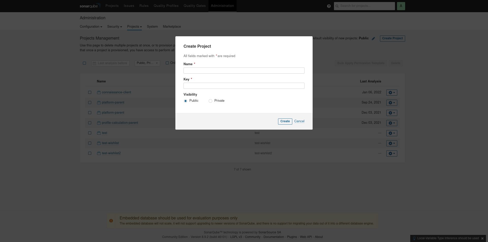
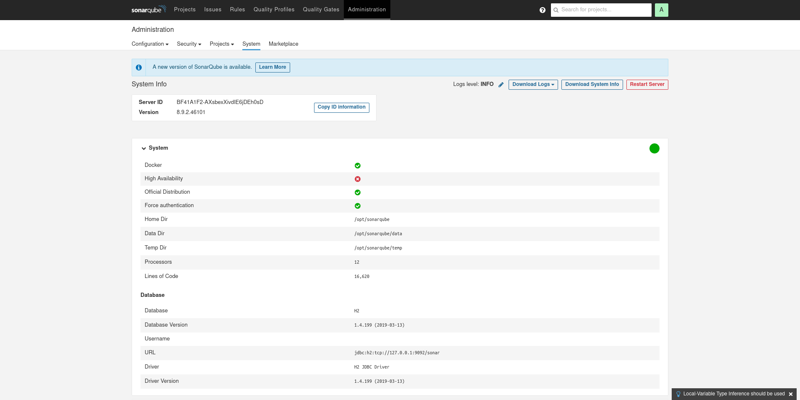
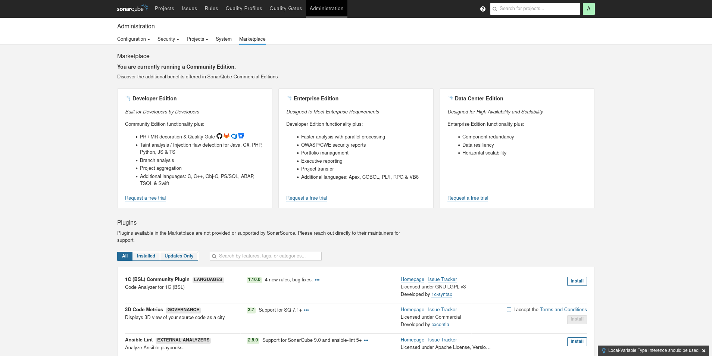
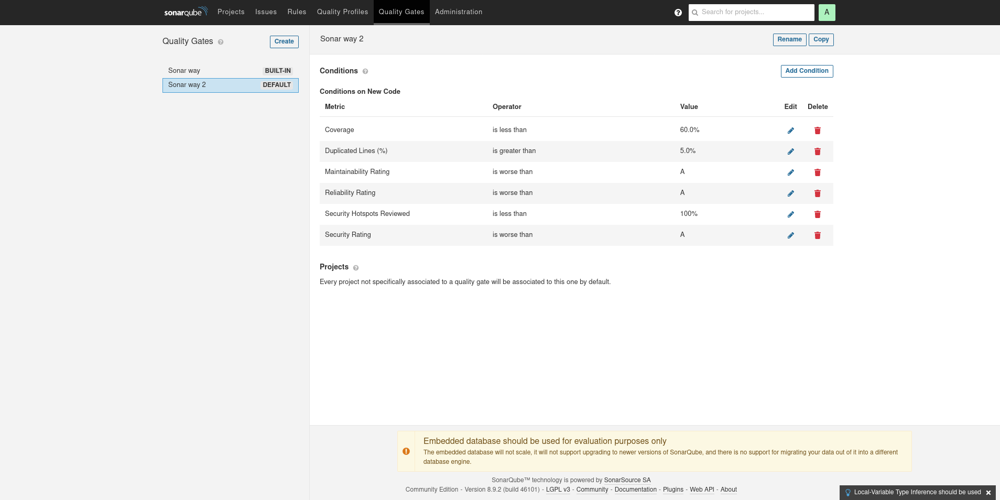
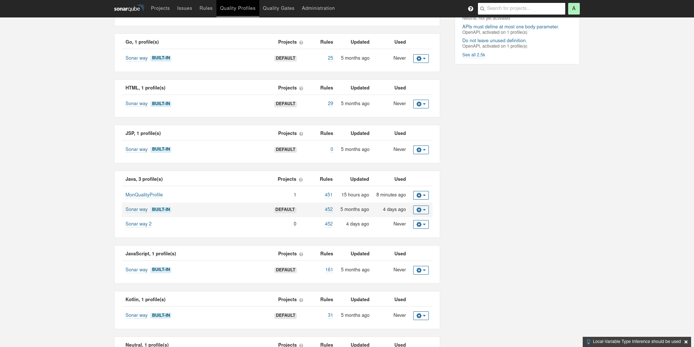

= Sonarqube : Administration

== Configuration Generale

== Utilisateurs

== Groupes

== Permissions

image:images/sonarqube-administration-permissions.png[]

== Projets

== Créer un projet

== Monitoring

== Pluggins

== Quality Gates

== Quality Profiles

== Configurer les Règles

image:images/sonarqube-quality-profile-rules.png[]

