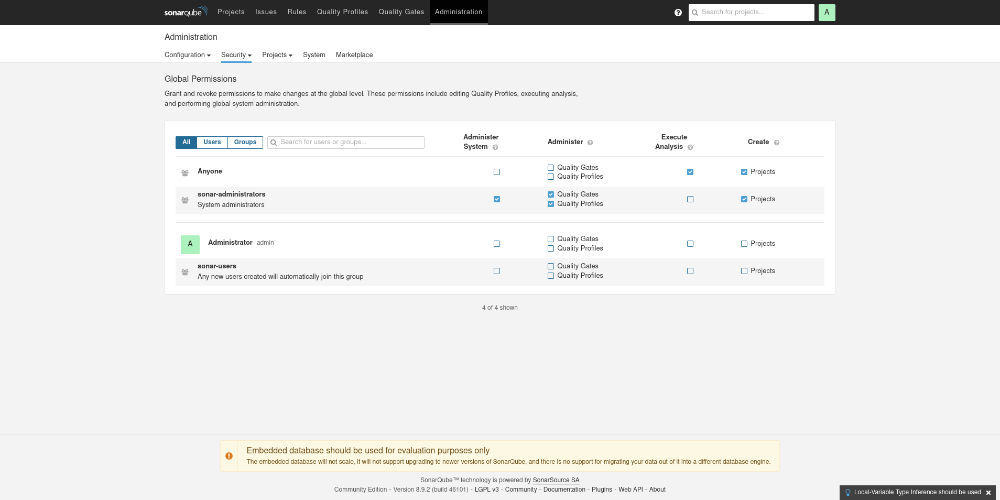
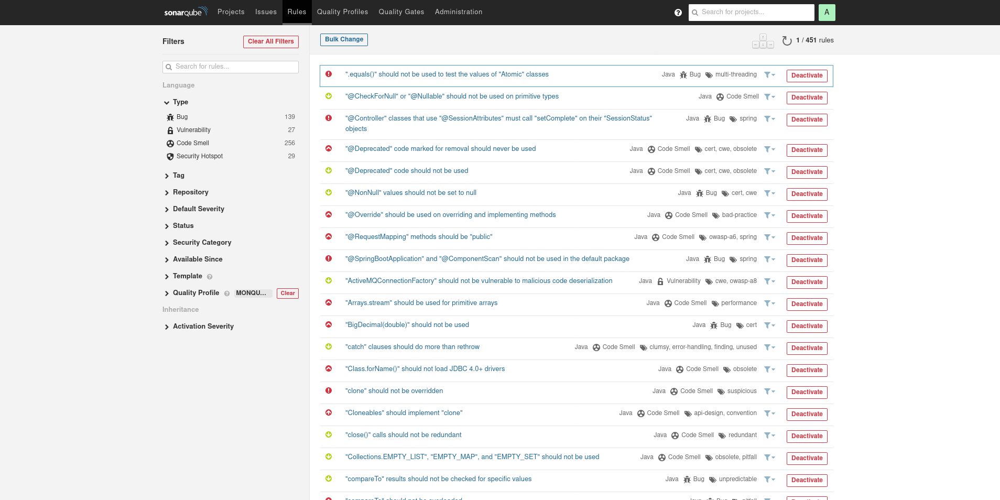

= Sonarqube : Administration

== Configuration Generale

== Utilisateurs

== Groupes

== Permissions

== Projets

== Créer un projet

== Monitoring

== Pluggins

image:images/sonarqube-administration-marketplace.png[]

== Quality Gates

== Quality Profiles

== Configurer les Règles

