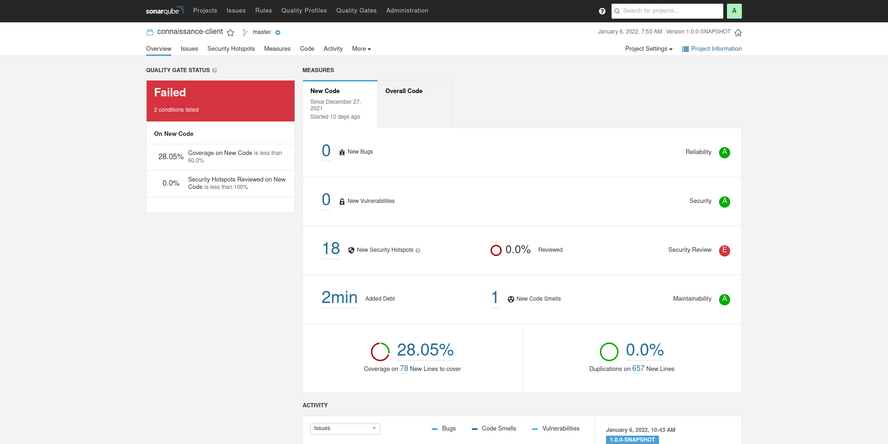
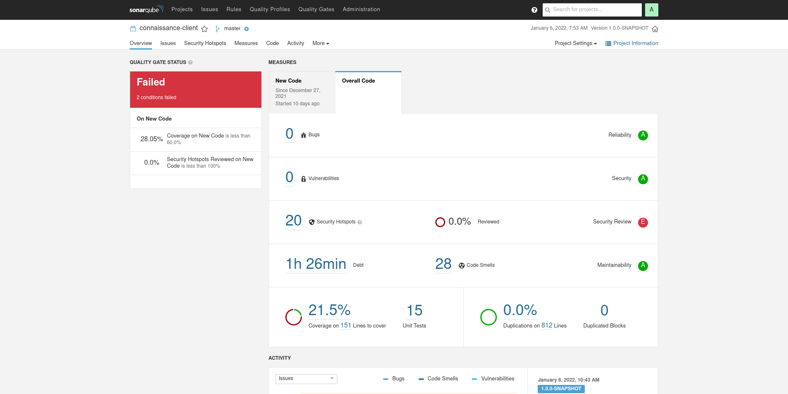
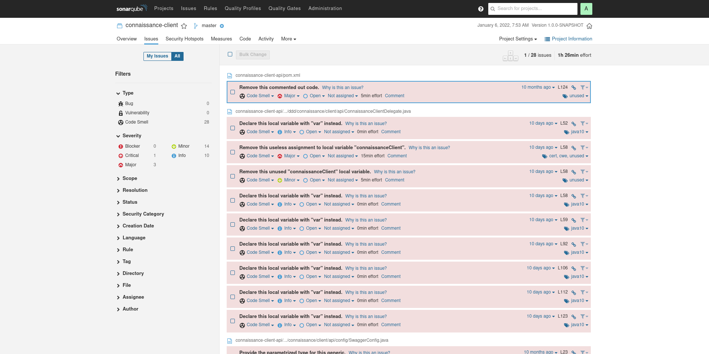
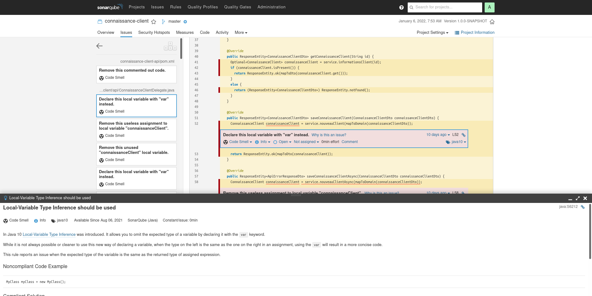
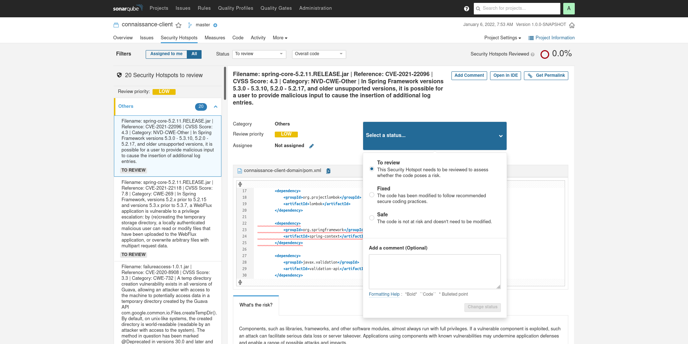
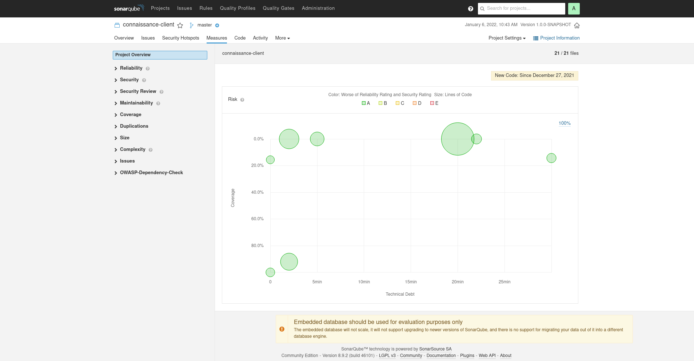
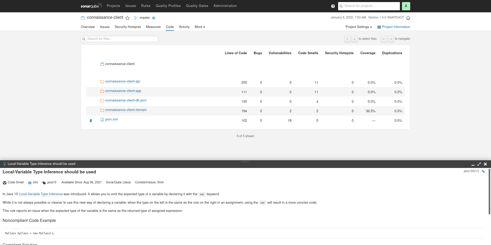
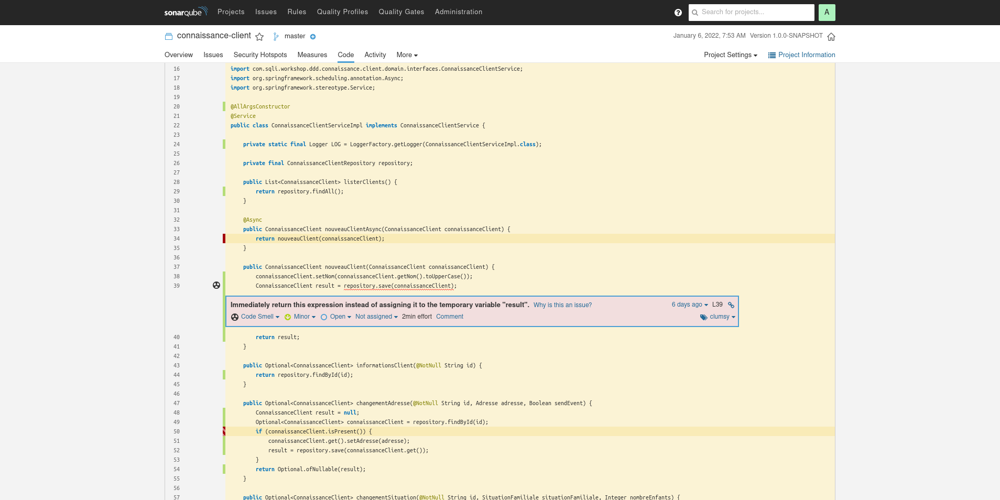
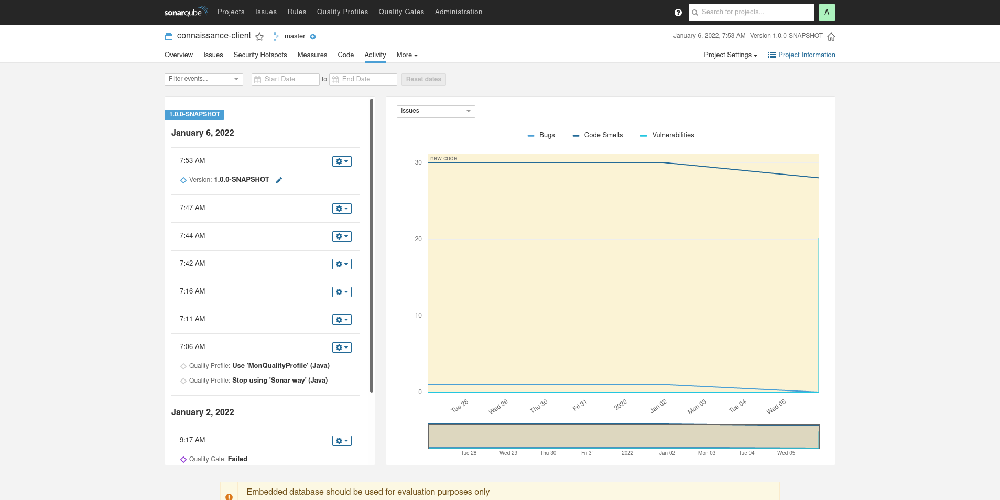
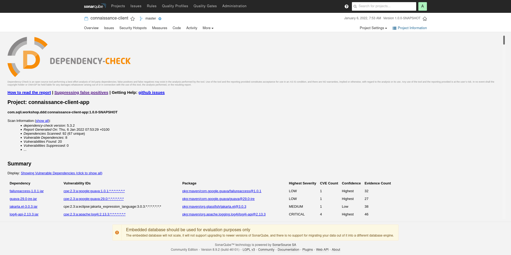

= Sonarqube : Analyse

== Lancer une analyse sonar

Via maven

[source, bash]
---- 
mvn clean package jacoco:report dependency-check:check sonar:sonar \
  -Dsonar.projectKey=<SONAR-PROJECT-KEY> \
  -Dsonar.host.url=<SONAR-URL> \
  -Dsonar.login=<SONAR-PROJECT-LOGIN>
----

== Ou via sonar-scanner

Il faut posséder un fichier de configuration sonar-project.properties

[source, bash]
----
sonar.login=<SONAR-LOGIN>
sonar.password=<SONAR-PASSWORD>
sonar.host.url=<SONAR-URL>
sonar.scm.disabled=true
----

[source, bash]
---- 
sudo docker run --rm -v ${path-to-config}:/config -v ${project-path}:/data sonar-scanner 
----

== Project : New Code

== Project : All Code

== Project : Issues

== Project : Issue Detail

== Project : Security Hotspots

== Project : Measures

== Project : Code

== Project : Code Detail

== Project : Activity

== Project : Dependency Check

