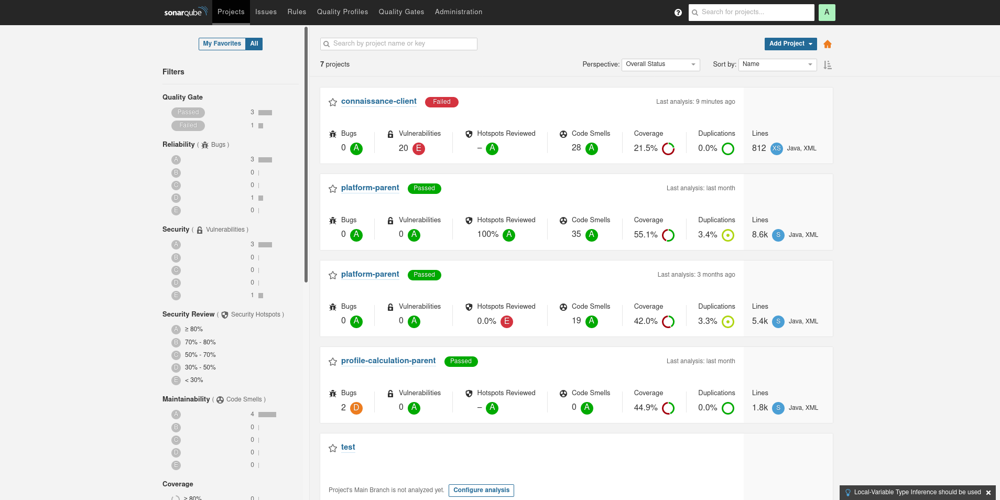

= Installer SonarQube

== Installation physique

Il est possible d'installer SonarQube au travers des binaires officiels : https://www.sonarqube.org/downloads/

Nécessitera : 

* d'installer le Java 11, 
* d'avoir une base de données, 
* de configurer le service...

== Ou via une image docker

[source, bash]
----
docker run -d --name sonarqube \
   --restart always \
   -p 9000:9000 -p 9092:9092 \
   -v /opt/sonarqube/conf:/opt/sonarqube/conf \  
   -v /opt/sonarqube/data:/opt/sonarqube/data \
   -v /opt/sonarqube/logs:/opt/sonarqube/logs \
   -v /opt/sonarqube/extensions:/opt/sonarqube/extensions \
   sonarqube
----

== Le Dashboard

