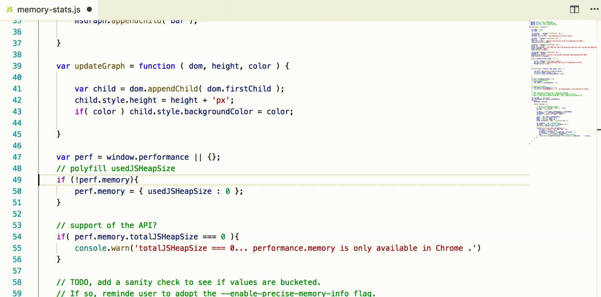
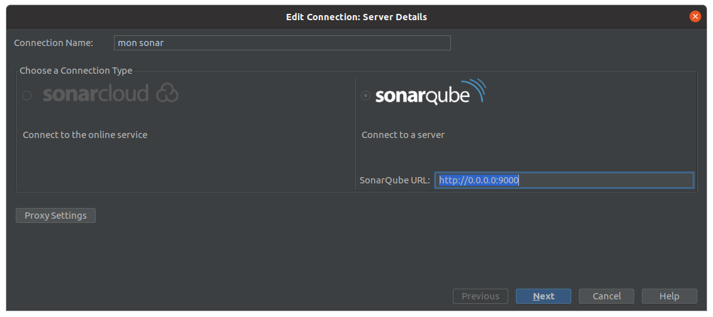
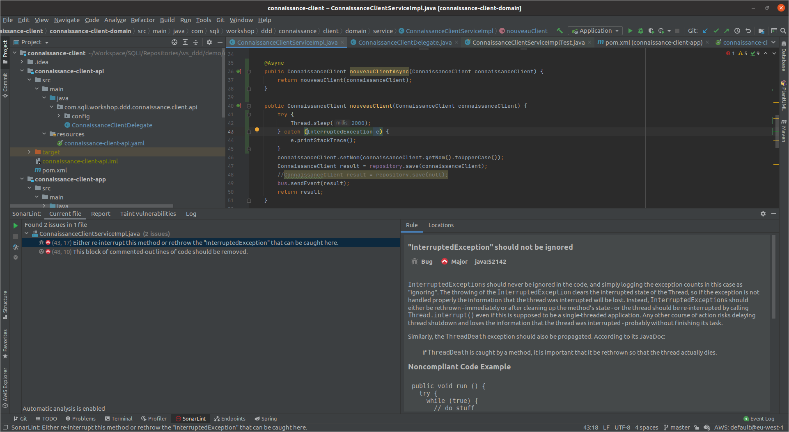
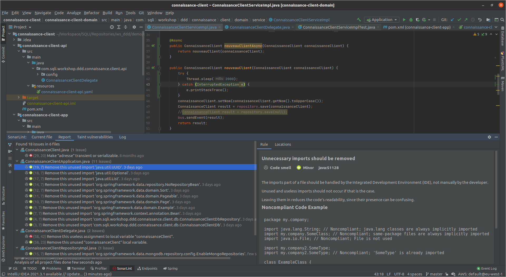
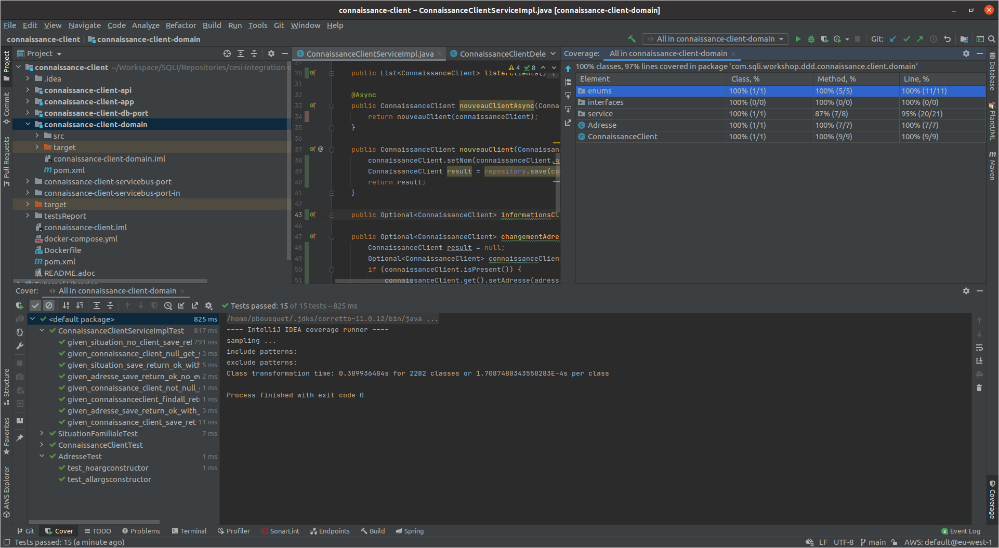

= Sonar dans son IDE

== Le plugin Sonarlint

Sonarlint esst un pluggin permettant l'analyse en temps réel du code produit par dun développeur directement dans son ide

== Installer le plugin

Le plugin est disponible pour plusieurs IDE : 

* Eclipse
* IntelliJ
* VS Code
* ...

Retrouver le sur https://www.sonarlint.org/

== Configurer le plugin

* Par default il utilise les indicateurs sonarway
* On peut cependant le configurer pour qu'il pointe vers SonarQube

== Analyse sur une classe

== Génération d'un rapport

== Code coverage

