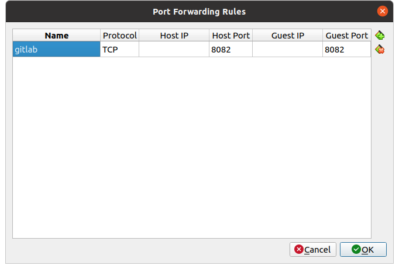

= Gitlab

== Contexte

Nous allons installer et manipuler gitlab au travers d'une image docker.
Pour le scommandes principales de gitlab : https://github.com/darken33/cesi-integration-continue/blob/main/others/docker-cheat-sheet-ultimate.pdf[docker-cheat-sheet-ultimate]

== Création des répertoires

[source=bash]
----
sudo mkdir /opt/gitlab 
sudo mkdir /opt/gitlab/config
sudo mkdir /opt/gitlab/logs
sudo mkdir /opt/gitlab/data
----

== Démarrer l'image docker

[source=bash]
----
sudo docker run --detach \
  -p 8082:80 -p 2222:22 \
  --name gitlab \
  --restart always \
  -v /opt/gitlab/config:/etc/gitlab \
  -v /opt/gitlab/logs:/var/log/gitlab \
  -v /opt/gitlab/data:/var/opt/gitlab \
  gitlab/gitlab-ce:latest
----

== Exposer le port 8082 de la VM

Éteindre la VM, puis dans les settings modifier la configuration réseau

== Exposer le port 8082 de la VM

Cliquer sur le bouton *ports forwarding*

== Se connecter à gitlab

Vous trouverez le mot de passe root (par défaut) dans le fichier :

[source=bash]
----
sudo cat /opt/gitlab/config/initial_root_password
----

Vous pouvez donc vous connecter sur gitlab : http://127.0.0.1:8082/

== Exercices

* créer un utilisateur user1
* créer un projet à la racine projet0 avec une visibilité public
* créer une groupe groupe1 privé
* créer un projet projet1 appartenant au groupe groupe1
* affecter le user1 au groupe1

== Exercices

* créer une groupe groupe2 privé
* créer un projet projet2 appartenant au groupe groupe2
* créer un projet à la racine projet3 internal
* se reconnecter avec le user1 et naviguer pour vérifier les projets auquels il peut accéder

== Exercices

* Cloner projet1
* Créer une branche feature/ma_fonctionnalité
* Modifier le fichier README.md (https://github.com/darken33/cesi-integration-continue/blob/main/others/markdown-cheat-sheet.md[markdown-cheat-sheet])
* Commitez et pusher vos modifications
* Effectuer une Merge Request assignée à l'utilisateur root
* Reconnectez vous au gitlab en root et validez la MR

== Exercices

* Importer le projet https://github.com/darken33/cesi-integration-continue/tree/main/hello-api[hello-api]
* Importer le projet https://github.com/darken33/cesi-integration-continue/tree/main/connaissance-client[connaissance-client]

