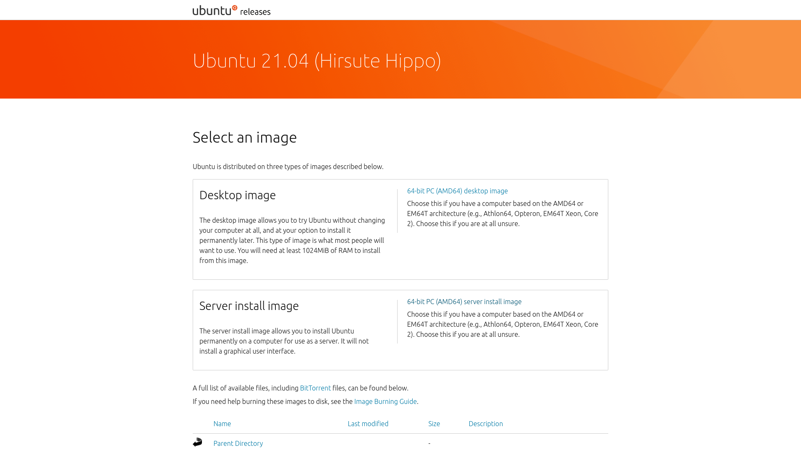
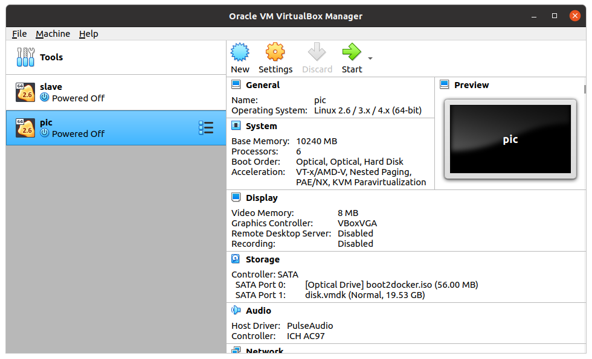
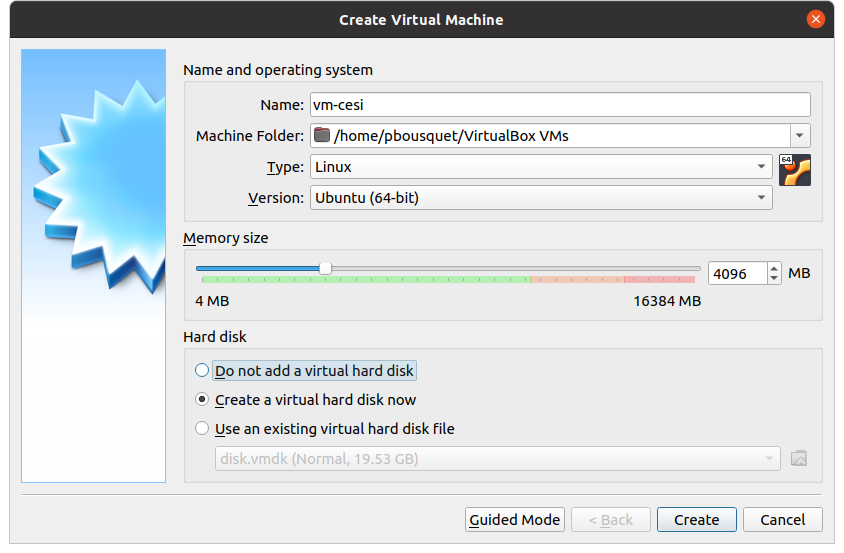
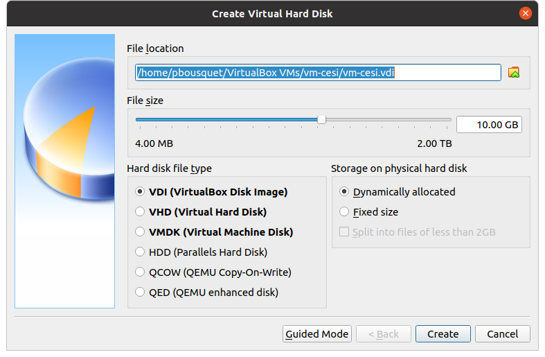
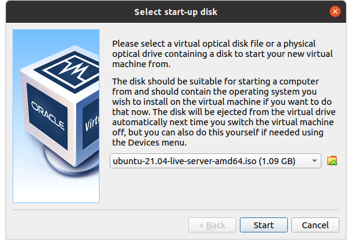
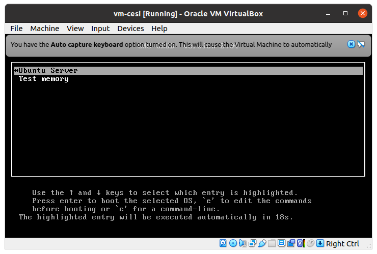
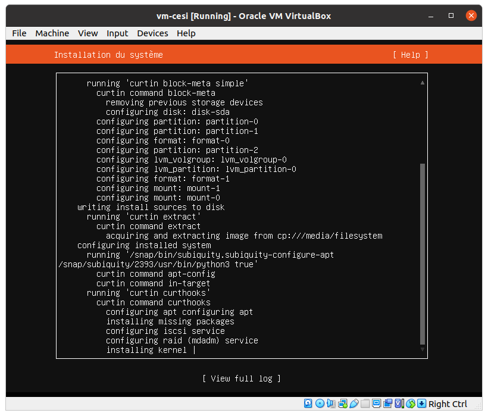

= Virtual Box : Serveur Linux

== Contexte

Dans l'objectif de ne pas avoir d'impact sur vos postes de travails nous allons effectuer l'ensemble de nos manipulation sur une machine virtuelle de type Serveur Linux tournant sur Virtual Box.

== Image ISO Ubuntu Server

La première étape consiste à récupérer une image ISO de la distribution Ubuntu 21.04 (version Server).

Vous pourrez la trouver sur : http://www.releases.ubuntu.com/21.04/

== Installer Virtual Box

Il faut alors installer Virtual Box afin de gérer notre future VM.

Vous pouvez le télécharger sous : https://www.virtualbox.org/wiki/Downloads 

== Créer une nouvelle VM

* name : vm-cesi (ou le nom qu'il vout chante)
* type : Linux / version : Ubuntu 64 bits
* mémoire : 4096 MB (4 Go)
* séléectionner : create a virtual hard disk now

== Créer un disque dur virtuel

* size : 10 GB
* type : VDI
* storage : Dynamically allocated

== Démarrage de la VM

Lors du démarrage, VitrualBox vous demande de sélectionner un image à partir de laquelle démarrer (sélectionner l'image linux téléchargée précédemment)

== Installation de linux server

Parmis les packages proposez sélectionnez : 

* docker
* aws cli

== Installation de linux server

== Finalisation de l'installation

Il semble que docker ne soit pas totalement installé, aussi utilisez la commande suivante

[source=bash]
----
sudo snap install docker
----

== Vérification de l'installation

Vérifier la version de linux : 
[source=bash]
----
lsb_release -a
----

Vérifier la version de aws cli : 
[source=bash]
----
aws --version
----

Vérifier la version de aws cli : 
[source=bash]
----
sudo docker version
----

== Naviguer sous linux

Voici un petit guide des commandes principales pour ubuntu : 

https://github.com/darken33/cesi-integration-continue/blob/main/others/davechild_linux-command-line.pdf[linux command line]
