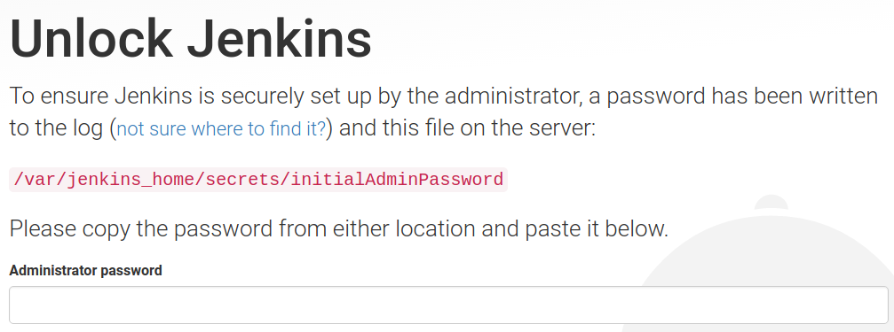
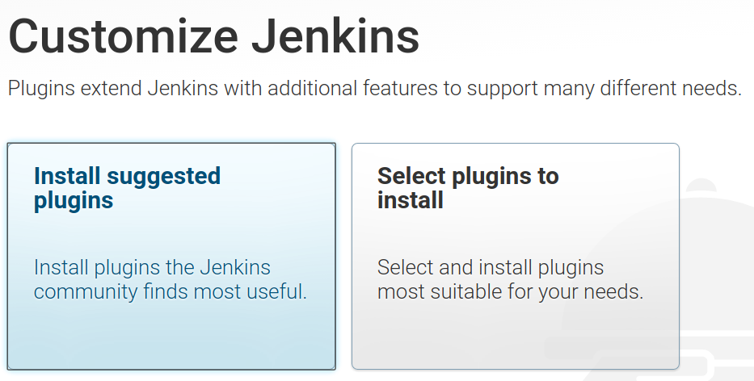
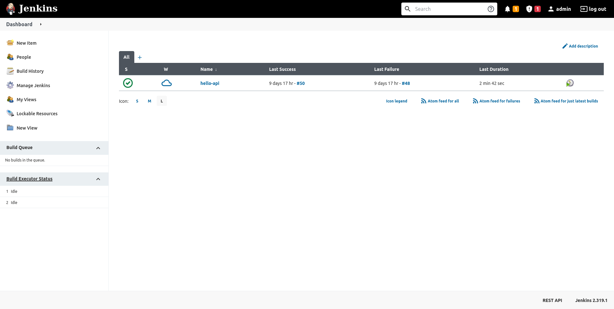
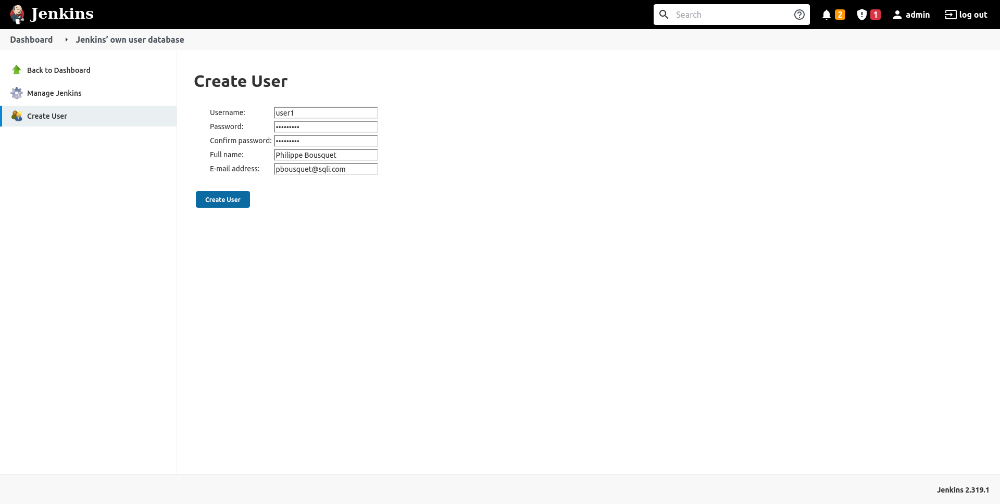
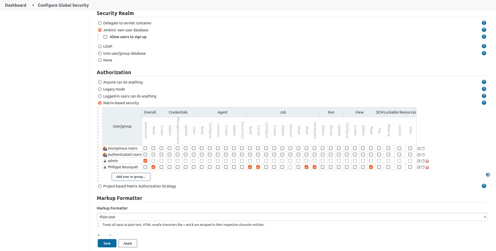
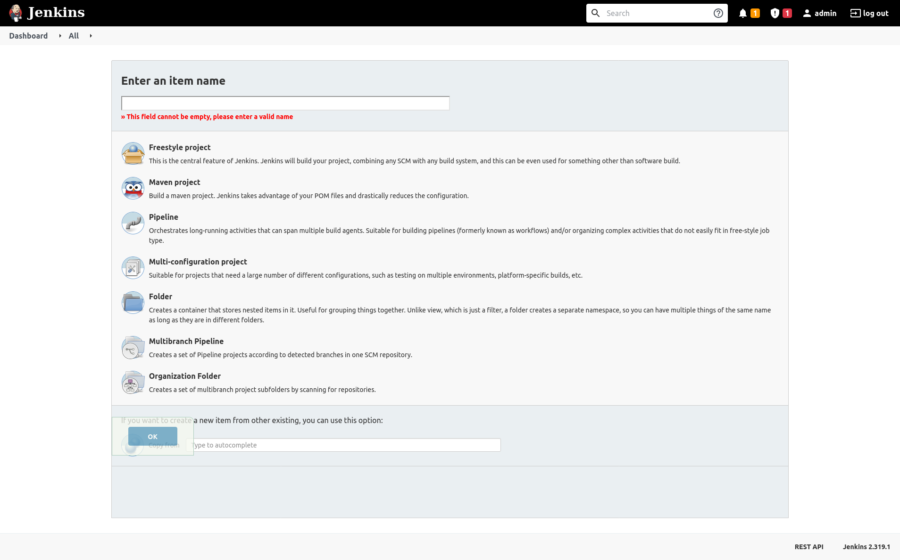

= Jenkins

== Contexte

Nous allons installer et manipuler Jenkins.

== Installation 

On peut l'installer au travers des paquest officiels

[source, bash]
----
curl -fsSL https://pkg.jenkins.io/debian/jenkins.io.key | sudo tee \
  /usr/share/keyrings/jenkins-keyring.asc > /dev/null
echo deb [signed-by=/usr/share/keyrings/jenkins-keyring.asc] \
  https://pkg.jenkins.io/debian binary/ | sudo tee \
  /etc/apt/sources.list.d/jenkins.list > /dev/null
sudo apt-get update
sudo apt-get install jenkins
----

== Nécessite Java

Pour fonctionner Jenkins à besoin de Java

[source, bash]
----
sudo apt update
sudo apt install openjdk-11-jdk
----

== Débloquer Jenkins

La première chose à faire est de débloquer jenkins (sécurité)

== Installer les plugins de base

Afin de vous aider lors de la finalisation de l'installation de Jenkins il vous proposera d'installer les plugins courants

== Le Dashboard

== Mise à niveau 

* Vérifier dans la page Manage/Pluggins les mises à jours
* En cas de mise à jour sélectionner le redémarrage automatique 

== Création d'un nouvel utilisateur

Vous pouvez alors créer un utilisateur

== Gestion des droits

Affectez les droits à ce nouvel utilisateurs

* Overall (Read), Job (Build, Cancel, Read, Workspace), View (Read)

== Créer un job

* Name : hello-api
* Type : Pipeline

== !

* Sélectionner parameterised
* Et ajouter un paramètre workingBranch de type string (valeur par défaut master)
* Poll SCM : * /5 * * * *
* Pipeline Script from SCM
* Repository : http://0.0.0.0:8082/root/hello-api.git 
* Eventuellement positionner un crédential si le projet n'est pas public
* Branch Spécifier : */master
* Script path : jenkinsfile

== Création d'un pipeline

Dans le projet hello-api editer le fichier jenkinsfile

[source, groovy]
----
node() {
    stage('STAGE1') {
        ...
    }

    stage('STAGE2') {
        ...
    }
}
----

== Ajouter la suppression du workspace

Permet de nettoyer le workspace

[source, groovy]
----
...
    stage('CLEAN WORKSPACE') {
        sh "echo ##### CLEAN WORKSPACE #####"
        sh "rm -rf ${workspace}/*"
    }
...
----

== Ajouter le checkout du repo git

Ici on remarque l'utilisation du paramètre workingBranch

[source, groovy]
----
...
    stage('CHECKOUT') {
        if (workingBranch == null || "" == workingBranch) {
            workingBranch = 'master'
        }
        sh "echo ##### CHECKOUT : ${workingBranch} #####"
        git branch: "${workingBranch}", url: "http://192.168.99.109:8082/root/hello-api.git"[, credentials: ""]
    }
...
----

== Ajouter le build Maven

On utilise une image docker

[source, groovy]
----
...
    stage('MAVEN BUILD') {
        sh "docker run --rm " +
            "-v /home/jenkins/.m2/repository:/root/.m2/repository " +
            "-v ${project_path}:/app " +
            "maven:3.8.4-jdk-11 clean package -U"
    }
...
----

== Commiter et Pusher

Le build doit se lancer automatiquement au bout de 5 minutes

== Se connecter à Jenkins

Se connecter avec l'utilisateur créé et vérifier que le job est bien exécuté
