= SonarQube

== Contexte

Nous allons installer et manipuler SonarQube et SonarLint.

== Installation 

On peut l'installer grâce à une image Docker

[source, bash]
----
docker run -d --name sonarqube \
   --restart always \
   -p 9000:9000 -p 9092:9092 \
   sonarqube
----

== Le Dashboard

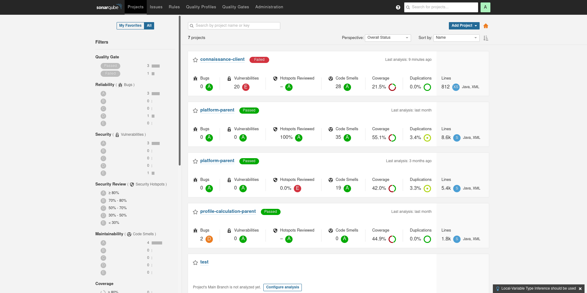

== Installer le Plugin Dependency Check 

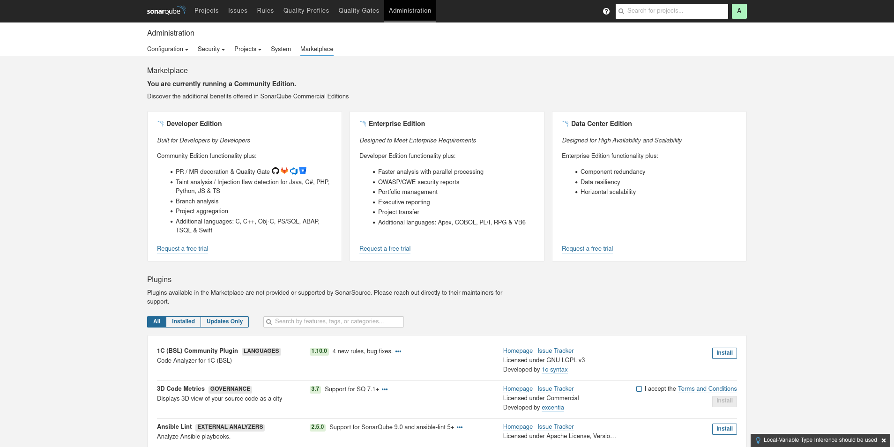

== Configurer le Plugin

Il faut intégrer le dependency check dans les security hotspot

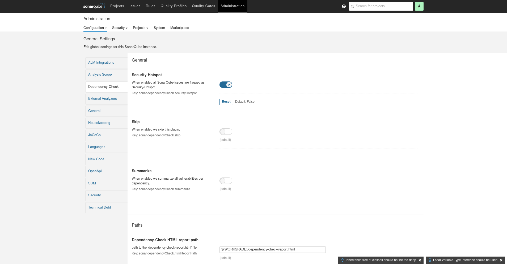

== Projet Hello Api

Créez un nouveau projet pour Hello Api

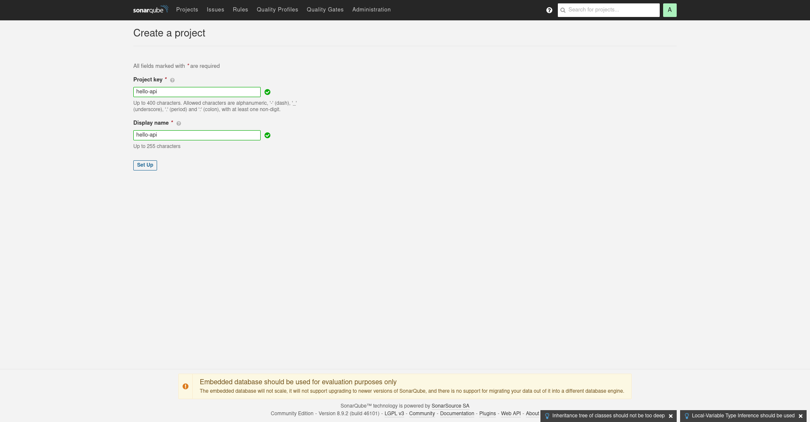

== Générer un Token

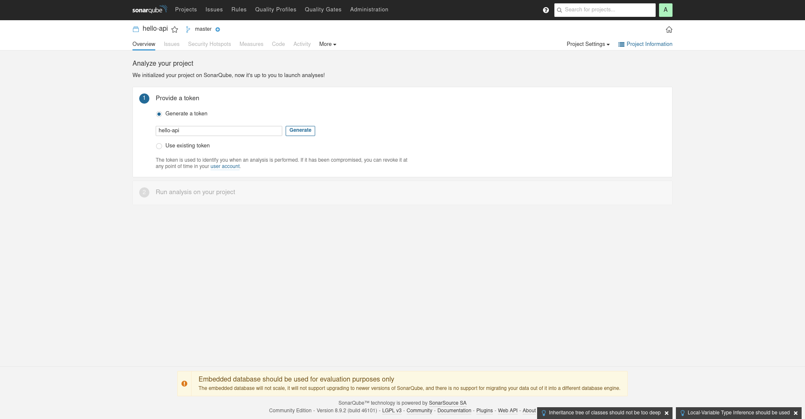

== Récupérer le Token

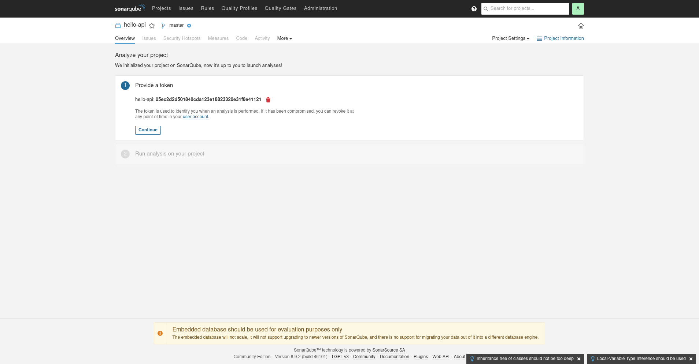

== La première Analyse Sonar

Récupérez la commande maven 

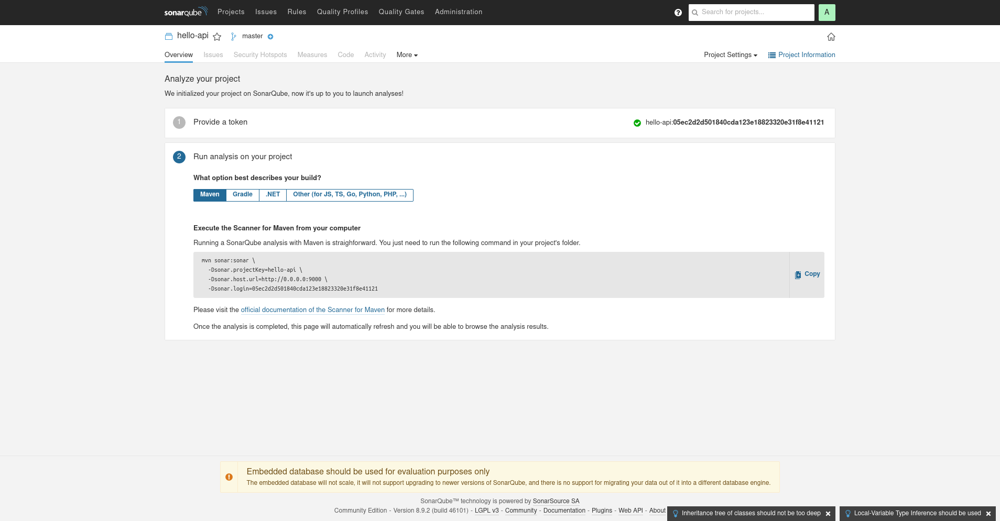

== Visulaiser la première analyse

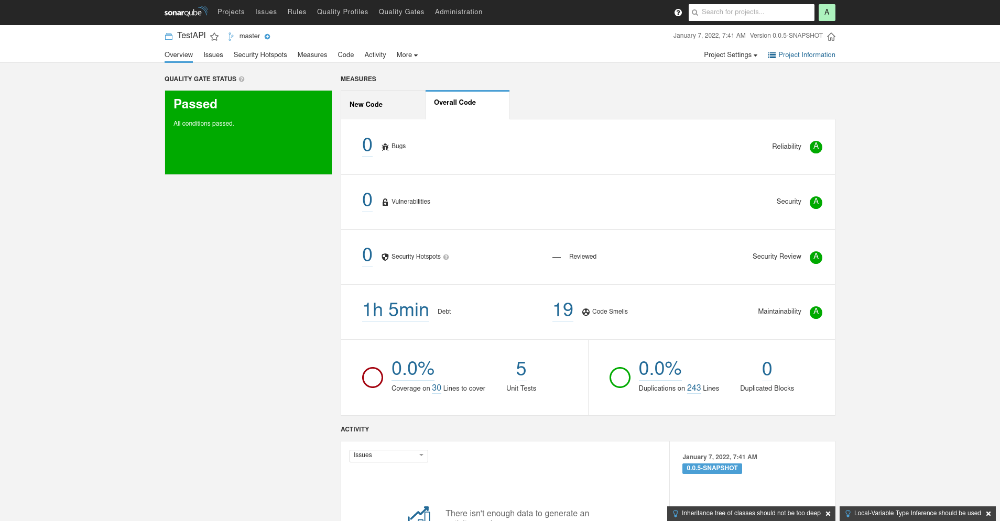

== Configuration Projet

Ajouter les plugins maven jacoco (Couverture de Test) et dependency-check dans le pom.xml du projet

[source, xml]
----
<build>
	<plugins>
                <!-- dependency check -->
                <plugin>
                    <groupId>org.owasp</groupId>
                    <artifactId>dependency-check-maven</artifactId>
                    <version>5.3.2</version>
                    <configuration>
                        <formats><format>HTML</format><format>XML</format></formats>
                    </configuration>
                    <executions>
                        <execution>
                            <goals>
                                <goal>aggregate</goal>
                            </goals>
                        </execution>
                    </executions>
                </plugin>
		<plugin>
			<groupId>org.jacoco</groupId>
			<artifactId>jacoco-maven-plugin</artifactId>
			<version>0.8.7</version>
			<configuration>
				<formats><format>XML</format></formats>
				<excludes>**/test/*</excludes>
			</configuration>
			<executions>
				<execution>
					<id>prepare</id>
					<goals>
						<goal>prepare-agent</goal>
					</goals>
				</execution>
				<execution>
					<id>report</id>
					<goals>
						<goal>report</goal>
					</goals>
				</execution>
			</executions>
		</plugin>
	</plugins>
</build>
----

== Configurer Sonarqube

Eventuellement configurez les chemins de rapport dependency check

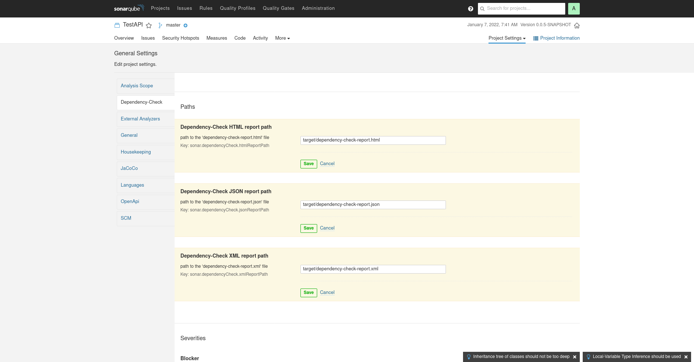

== Le pipeline 

Intégrez un nouveau stage SonarQube dans votre Pipeline

[source, groovy]
----
...
    stage('SONARQUBE') {
        sh "mvn test jacoco:report dependency-check:check sonar:sonar" +
           "  -Dsonar.projectKey=hello-api" +
           "  -Dsonar.host.url=http://0.0.0.0:9000" +
           "  -Dsonar.login=05ec2d2d501840cda123e18823320e31f8e41121"
    }
...
----

== Utiliser un crédential

Vous Pouvez configurer le login Sonar en tant que Crédential

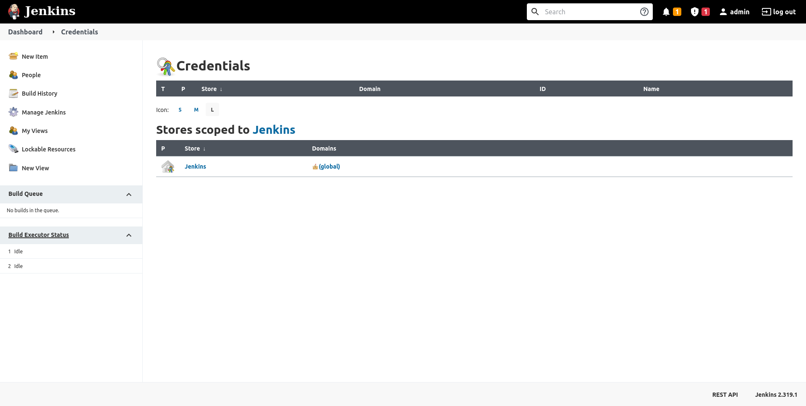

== Analyser le résultat SonarQube

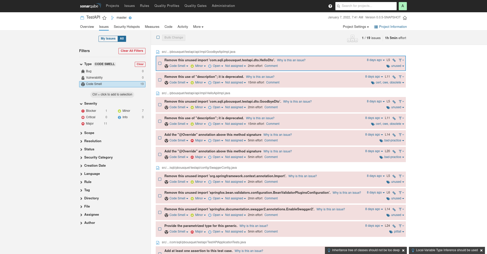

== Installer le plugin Sonarlint

Le plugin est disponible pour plusieurs IDE : 

* Eclipse
* IntelliJ
* VS Code
* ...

Retrouver le sur https://www.sonarlint.org/

== Corriger et vérifier le résultat

Corriger quelques anomalies remontées par sonarqube en vous aidant du plugin

Commit/Push et vérifiez l'évolution des indicateurs

